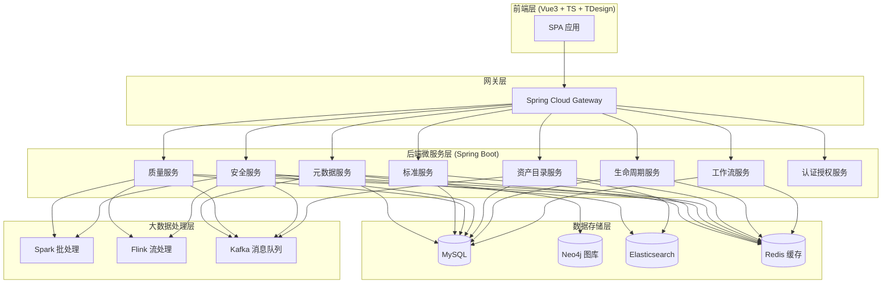
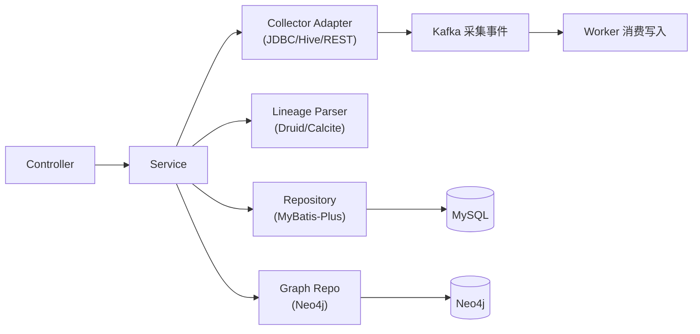
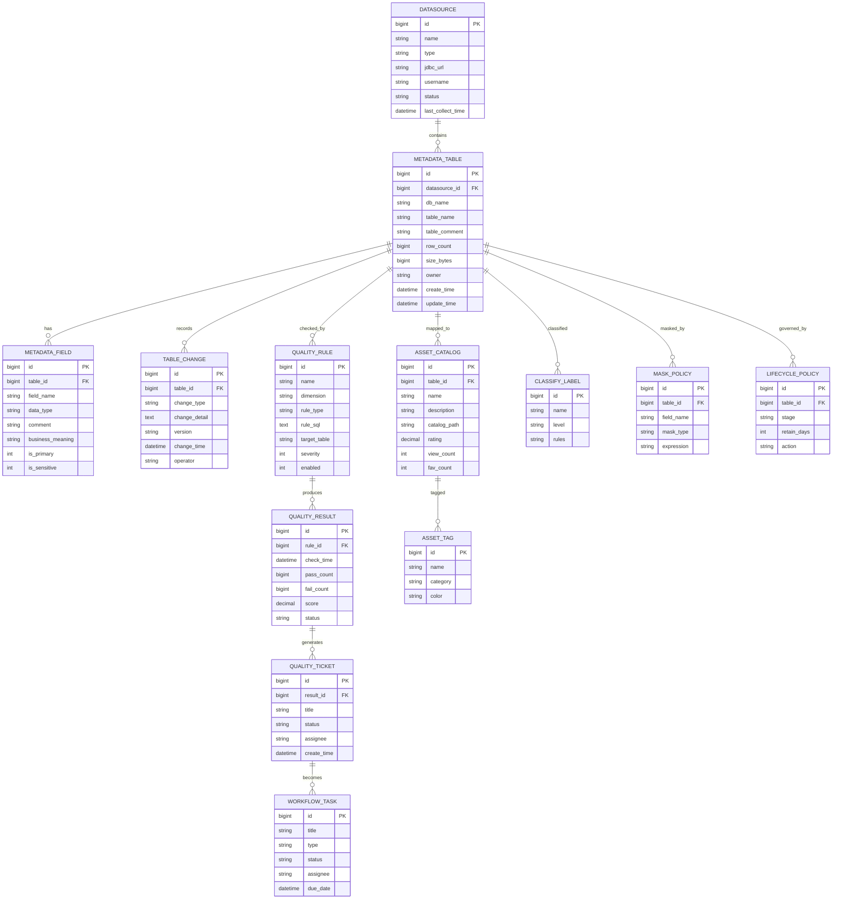

# 数据治理平台 技术架构文档

## 1. 架构设计

平台采用前后端分离 + 微服务的整体架构。前端基于 Vue3 + TypeScript + TDesign 单页应用；后端采用 Spring Boot + Spring Cloud 微服务体系，按七大治理域划分服务模块，通过统一网关对外暴露 API。



### 架构说明
- **前端**：单仓单应用，模块化路由按治理域划分，统一布局与权限。
- **网关**：统一入口，路由转发、鉴权、限流。
- **微服务**：每个治理域独立服务，独立数据库 schema（逻辑隔离），通过 REST/RPC 通信。
- **存储**：MySQL 存配置/元数据事实，Neo4j 存血缘图，ES 存检索宽表与审计日志，Redis 缓存评分与会话。
- **大数据**：Spark 跑批量质量稽核/敏感扫描，Flink 流式增量采集与行为聚合，Kafka 解耦采集事件。

## 2. 技术说明

### 前端技术栈
- **框架**：Vue@3.4 + TypeScript@5.4
- **构建工具**：Vite@5
- **UI 库**：TDesign Vue Next `tdesign-vue-next`
- **路由**：Vue Router@4
- **状态管理**：Pinia@2
- **HTTP**：Axios + 统一拦截器
- **可视化**：AntV G6@4（血缘图）、ECharts@5（图表）
- **代码编辑器**：Monaco Editor（自定义 SQL 规则）
- **拖拽**：vuedraggable（治理看板）
- **工具库**：dayjs、lodash-es、vueuse
- **样式**：SCSS + CSS 变量主题（亮/暗）

### 后端技术栈
- **框架**：Java 17 + Spring Boot 3.2 + Spring Cloud 2023
- **微服务组件**：Nacos（注册/配置）、Gateway（网关）、OpenFeign（服务调用）
- **持久层**：MyBatis-Plus + MySQL 8
- **图库**：Neo4j（血缘存储与查询）
- **搜索**：Elasticsearch 8（资产检索、审计日志）
- **缓存**：Redis 7（评分、会话、限流）
- **消息队列**：Kafka（采集事件、告警）
- **调度**：XXL-JOB（定时采集、稽核任务）
- **工作流**：Flowable（审批/工单流程）
- **SQL 解析**：Druid / Apache Calcite（血缘抽取）
- **大数据**：Spark 3.5、Flink 1.18（按需集成）
- **监控**：Prometheus + Grafana + Spring Boot Actuator

## 3. 路由定义

### 前端路由（核心）

| 路由 | 页面 | 说明 |
|------|------|------|
| `/login` | 登录 | 用户登录页 |
| `/` | 工作台首页 | 治理概览、指标卡片、待办 |
| `/metadata/overview` | 资产全景图 | 元数据统计概览 |
| `/metadata/datasource` | 数据源管理 | 数据源 CRUD |
| `/metadata/table/:id` | 表详情 | 字段/血缘/变更 |
| `/metadata/lineage` | 血缘图谱 | 画布式血缘 |
| `/standard/tree` | 标准树 | 标准管理 |
| `/standard/mapping` | 标准映射 | 落标映射 |
| `/standard/audit` | 落标稽核 | 稽核报告 |
| `/quality/rule` | 质量规则 | 规则配置 |
| `/quality/dashboard` | 质量看板 | 质量大屏 |
| `/quality/ticket` | 质量工单 | 工单协作 |
| `/security/classify` | 分级标签 | 分类分级 |
| `/security/sensitive-map` | 敏感地图 | 敏感分布 |
| `/security/mask` | 脱敏策略 | 脱敏配置 |
| `/security/audit` | 审计日志 | 日志检索 |
| `/catalog/search` | 资产检索 | 搜索门户 |
| `/catalog/asset/:id` | 资产详情 | 资产详情 |
| `/catalog/tag` | 标签管理 | 标签体系 |
| `/catalog/workspace` | 个人工作台 | 我的资产 |
| `/lifecycle/policy` | 生命周期策略 | 策略配置 |
| `/lifecycle/dashboard` | 生命周期仪表盘 | 监控大屏 |
| `/workflow/board` | 治理看板 | 看板视图 |
| `/workflow/todo` | 我的待办 | 待办列表 |

## 4. API 定义

### 通用响应结构
```typescript
interface ApiResult<T> {
  code: number;       // 0 表示成功
  message: string;
  data: T;
  traceId: string;
}
interface PageResult<T> {
  list: T[];
  total: number;
  page: number;
  size: number;
}
```

### 元数据服务 API

| 方法 | 路径 | 说明 |
|------|------|------|
| GET | `/api/metadata/datasources` | 数据源分页列表 |
| POST | `/api/metadata/datasources` | 新增数据源 |
| PUT | `/api/metadata/datasources/{id}` | 修改数据源 |
| DELETE | `/api/metadata/datasources/{id}` | 删除数据源 |
| POST | `/api/metadata/datasources/{id}/collect` | 触发采集 |
| GET | `/api/metadata/tables` | 表分页列表 |
| GET | `/api/metadata/tables/{id}` | 表详情(含字段) |
| GET | `/api/metadata/tables/{id}/lineage` | 表级血缘 |
| GET | `/api/metadata/lineage/field/{tableId}/{field}` | 字段级血缘 |
| GET | `/api/metadata/tables/{id}/changes` | 变更历史 |

### 数据质量 API

| 方法 | 路径 | 说明 |
|------|------|------|
| GET | `/api/quality/rules` | 规则列表 |
| POST | `/api/quality/rules` | 新建规则 |
| PUT | `/api/quality/rules/{id}` | 修改规则 |
| POST | `/api/quality/rules/{id}/trial` | 规则试跑 |
| GET | `/api/quality/score` | 质量评分 |
| GET | `/api/quality/score/trend` | 评分趋势 |
| GET | `/api/quality/issues` | 问题热力矩阵 |
| GET | `/api/quality/tickets` | 工单列表 |
| PUT | `/api/quality/tickets/{id}/status` | 工单状态流转 |

### 资产目录 API

| 方法 | 路径 | 说明 |
|------|------|------|
| GET | `/api/catalog/search` | 资产检索(关键词/筛选) |
| GET | `/api/catalog/assets/{id}` | 资产详情 |
| POST | `/api/catalog/assets/{id}/fav` | 收藏 |
| POST | `/api/catalog/assets/{id}/rate` | 评分 |
| GET | `/api/catalog/tags` | 标签树 |
| POST | `/api/catalog/assets/{id}/tags` | 打标 |
| GET | `/api/catalog/workspace` | 个人工作台 |

### 数据安全 API

| 方法 | 路径 | 说明 |
|------|------|------|
| GET | `/api/security/classify` | 分级分类列表 |
| POST | `/api/security/classify/scan` | 敏感扫描 |
| GET | `/api/security/mask/policies` | 脱敏策略列表 |
| POST | `/api/security/mask/policies` | 新建脱敏策略 |
| GET | `/api/security/audit/logs` | 审计日志检索 |

### 工作流 API

| 方法 | 路径 | 说明 |
|------|------|------|
| GET | `/api/workflow/tasks` | 任务列表 |
| PUT | `/api/workflow/tasks/{id}/status` | 任务状态流转 |
| GET | `/api/workflow/todo` | 我的待办 |

## 5. 服务架构图（以元数据服务为例）



## 6. 数据模型

### 6.1 核心数据模型 ER 图



### 6.2 核心 DDL（MySQL）

```sql
-- 数据源
CREATE TABLE datasource (
  id BIGINT PRIMARY KEY AUTO_INCREMENT,
  name VARCHAR(128) NOT NULL,
  type VARCHAR(32) NOT NULL COMMENT 'MYSQL/HIVE/POSTGRESQL/REST',
  jdbc_url VARCHAR(512),
  username VARCHAR(64),
  password VARCHAR(256),
  status VARCHAR(16) DEFAULT 'ACTIVE',
  last_collect_time DATETIME,
  create_time DATETIME DEFAULT CURRENT_TIMESTAMP,
  update_time DATETIME DEFAULT CURRENT_TIMESTAMP ON UPDATE CURRENT_TIMESTAMP
);

-- 元数据表
CREATE TABLE metadata_table (
  id BIGINT PRIMARY KEY AUTO_INCREMENT,
  datasource_id BIGINT NOT NULL,
  db_name VARCHAR(128),
  table_name VARCHAR(128) NOT NULL,
  table_comment VARCHAR(512),
  row_count BIGINT DEFAULT 0,
  size_bytes BIGINT DEFAULT 0,
  owner VARCHAR(64),
  create_time DATETIME DEFAULT CURRENT_TIMESTAMP,
  update_time DATETIME DEFAULT CURRENT_TIMESTAMP ON UPDATE CURRENT_TIMESTAMP,
  INDEX idx_datasource (datasource_id),
  INDEX idx_name (table_name)
);

-- 元数据字段
CREATE TABLE metadata_field (
  id BIGINT PRIMARY KEY AUTO_INCREMENT,
  table_id BIGINT NOT NULL,
  field_name VARCHAR(128) NOT NULL,
  data_type VARCHAR(64),
  comment VARCHAR(512),
  business_meaning VARCHAR(512),
  is_primary TINYINT DEFAULT 0,
  is_sensitive TINYINT DEFAULT 0,
  INDEX idx_table (table_id)
);

-- 表变更历史
CREATE TABLE table_change (
  id BIGINT PRIMARY KEY AUTO_INCREMENT,
  table_id BIGINT NOT NULL,
  change_type VARCHAR(32) COMMENT 'ADD_FIELD/DROP_FIELD/MODIFY_TYPE/RENAME',
  change_detail TEXT,
  version VARCHAR(32),
  change_time DATETIME DEFAULT CURRENT_TIMESTAMP,
  operator VARCHAR(64),
  INDEX idx_table (table_id)
);

-- 质量规则
CREATE TABLE quality_rule (
  id BIGINT PRIMARY KEY AUTO_INCREMENT,
  name VARCHAR(128) NOT NULL,
  dimension VARCHAR(32) COMMENT '完整性/唯一性/准确性/规范性/时效性',
  rule_type VARCHAR(32) COMMENT 'TEMPLATE/SQL',
  rule_sql TEXT,
  target_table VARCHAR(128),
  severity TINYINT DEFAULT 1,
  enabled TINYINT DEFAULT 1,
  create_time DATETIME DEFAULT CURRENT_TIMESTAMP
);

-- 质量结果
CREATE TABLE quality_result (
  id BIGINT PRIMARY KEY AUTO_INCREMENT,
  rule_id BIGINT NOT NULL,
  check_time DATETIME DEFAULT CURRENT_TIMESTAMP,
  pass_count BIGINT DEFAULT 0,
  fail_count BIGINT DEFAULT 0,
  score DECIMAL(5,2),
  status VARCHAR(16),
  INDEX idx_rule (rule_id),
  INDEX idx_time (check_time)
);

-- 质量工单
CREATE TABLE quality_ticket (
  id BIGINT PRIMARY KEY AUTO_INCREMENT,
  result_id BIGINT,
  title VARCHAR(256),
  status VARCHAR(16) DEFAULT 'OPEN' COMMENT 'OPEN/PROCESSING/RESOLVED/CLOSED',
  assignee VARCHAR(64),
  create_time DATETIME DEFAULT CURRENT_TIMESTAMP,
  update_time DATETIME DEFAULT CURRENT_TIMESTAMP ON UPDATE CURRENT_TIMESTAMP
);

-- 资产目录
CREATE TABLE asset_catalog (
  id BIGINT PRIMARY KEY AUTO_INCREMENT,
  table_id BIGINT,
  name VARCHAR(128),
  description VARCHAR(1024),
  catalog_path VARCHAR(512),
  rating DECIMAL(3,1) DEFAULT 0,
  view_count INT DEFAULT 0,
  fav_count INT DEFAULT 0,
  create_time DATETIME DEFAULT CURRENT_TIMESTAMP,
  INDEX idx_table (table_id)
);

-- 标签
CREATE TABLE asset_tag (
  id BIGINT PRIMARY KEY AUTO_INCREMENT,
  name VARCHAR(64) NOT NULL,
  category VARCHAR(64),
  color VARCHAR(16)
);

-- 分级分类
CREATE TABLE classify_label (
  id BIGINT PRIMARY KEY AUTO_INCREMENT,
  name VARCHAR(64) NOT NULL,
  level VARCHAR(16) COMMENT 'L1/L2/L3/L4',
  rules TEXT COMMENT '正则/字典'
);

-- 脱敏策略
CREATE TABLE mask_policy (
  id BIGINT PRIMARY KEY AUTO_INCREMENT,
  table_id BIGINT,
  field_name VARCHAR(128),
  mask_type VARCHAR(32) COMMENT 'MASK/REPLACE/ENCRYPT/HASH',
  expression VARCHAR(256)
);

-- 生命周期策略
CREATE TABLE lifecycle_policy (
  id BIGINT PRIMARY KEY AUTO_INCREMENT,
  table_id BIGINT,
  stage VARCHAR(16) COMMENT 'HOT/WARM/COLD/DELETE',
  retain_days INT,
  action VARCHAR(64)
);

-- 工作流任务
CREATE TABLE workflow_task (
  id BIGINT PRIMARY KEY AUTO_INCREMENT,
  title VARCHAR(256),
  type VARCHAR(32),
  status VARCHAR(16) DEFAULT 'TODO' COMMENT 'TODO/DOING/DONE',
  assignee VARCHAR(64),
  due_date DATETIME,
  create_time DATETIME DEFAULT CURRENT_TIMESTAMP
);
```
